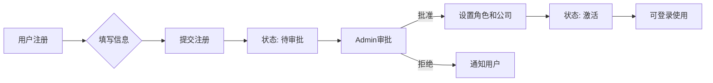
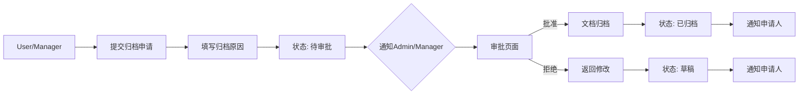

# AI Prompt - 项目文档管理中心 v3.0

## 系统概述

**项目名称**: 项目文档管理中心 v3.0  
**架构**: Next.js + SQLite + Python 微服务  
**目标**: 企业级多用户文档管理系统，支持权限分离、审批流程、审计日志

## 核心架构

```
┌─────────────────────────────────────────────────────────────────┐
│                        Next.js 主服务                            │
│  ┌─────────────┐  ┌─────────────┐  ┌─────────────────────────┐  │
│  │   Web UI    │  │  API Routes │  │    Auth/Permission      │  │
│  │  (Admin/    │  │  (App/      │  │    (RBAC Middleware)    │  │
│  │   User)     │  │   Project)  │  │                         │  │
│  └──────┬──────┘  └──────┬──────┘  └───────────┬─────────────┘  │
│         └─────────────────┴─────────────────────┘                │
│                          │                                       │
│         ┌────────────────┼────────────────┐                      │
│         ▼                ▼                ▼                      │
│  ┌─────────────┐  ┌─────────────┐  ┌─────────────┐              │
│  │ platform.db │  │ proj_001.db │  │ proj_002.db │              │
│  │ (系统数据)   │  │ (项目数据)  │  │ (项目数据)  │              │
│  └─────────────┘  └─────────────┘  └─────────────┘              │
└─────────────────────────────────────────────────────────────────┘
                              │
         ┌────────────────────┼────────────────────┐
         ▼                    ▼                    ▼
┌─────────────────┐  ┌─────────────────┐  ┌─────────────────┐
│ Python图像服务   │  │ Python文档服务   │  │  定时任务服务    │
│ (Docker容器)     │  │ (Docker容器)     │  │  (WAL压缩/清理)  │
│                 │  │                 │  │                 │
│ • 签字识别      │  │ • PDF转图片      │  │ • 每日VACUUM    │
│ • 盖章识别      │  │ • Office转PDF   │  │ • 日志归档       │
│ • OCR文本提取   │  │ • 文档合并       │  │ • 监控告警       │
└─────────────────┘  └─────────────────┘  └─────────────────┘
```

## 技术栈

### 前端
- **Next.js 14** (App Router)
- **TypeScript** + **Tailwind CSS**
- **shadcn/ui** 组件库
- **React Query** (TanStack Query) 数据管理
- **Zustand** 状态管理

### 后端
- **Next.js API Routes** (主服务)
- **better-sqlite3** (SQLite驱动，启用线程安全)
- **gRPC** (与Python服务通信)
- **Bull Queue** (Redis任务队列)

### Python微服务
- **Docker容器** 独立部署
- **gRPC** 图像识别服务 (签字/盖章/OCR)
- **HTTP API** 文档处理服务 (PDF/Office转换)
- **OpenCV** + **PaddleOCR** / **Tesseract**
- **LibreOffice** (Office文档转换)

### 基础设施
- **SQLite** (线程安全编译: SQLITE_THREADSAFE=1)
- **Redis** (任务队列 + 会话缓存)
- **PM2** (Node.js进程管理)
- **Docker Compose** (服务编排)
- **Prometheus + Grafana** (监控)

## 数据库设计

### platform.db (系统数据库)

```sql
-- 用户表
CREATE TABLE users (
    id TEXT PRIMARY KEY,
    username TEXT UNIQUE NOT NULL,
    email TEXT UNIQUE NOT NULL,
    password_hash TEXT NOT NULL,
    role TEXT CHECK(role IN ('admin', 'manager', 'user')) DEFAULT 'user',
    company_id TEXT NOT NULL,
    department TEXT,
    status TEXT CHECK(status IN ('pending', 'active', 'suspended', 'archived')) DEFAULT 'pending',
    created_by TEXT,
    approved_by TEXT,
    approved_at TEXT,
    created_at TEXT DEFAULT CURRENT_TIMESTAMP,
    updated_at TEXT DEFAULT CURRENT_TIMESTAMP,
    last_login_at TEXT,
    FOREIGN KEY (company_id) REFERENCES companies(id)
);

-- 公司表
CREATE TABLE companies (
    id TEXT PRIMARY KEY,
    name TEXT NOT NULL,
    type TEXT CHECK(type IN ('party_a', 'party_b', 'supervisor', 'manager')) NOT NULL,
    code TEXT UNIQUE NOT NULL,
    contact_name TEXT,
    contact_phone TEXT,
    contact_email TEXT,
    address TEXT,
    status TEXT DEFAULT 'active',
    created_at TEXT DEFAULT CURRENT_TIMESTAMP
);

-- 审计日志表
CREATE TABLE audit_logs (
    id INTEGER PRIMARY KEY AUTOINCREMENT,
    user_id TEXT NOT NULL,
    action TEXT NOT NULL,  -- CREATE_PROJECT, UPLOAD_DOC, ARCHIVE_REQ, etc.
    resource_type TEXT NOT NULL,  -- project, document, user, etc.
    resource_id TEXT,
    details TEXT,  -- JSON格式详细数据
    ip_address TEXT,
    user_agent TEXT,
    timestamp TEXT DEFAULT CURRENT_TIMESTAMP,
    FOREIGN KEY (user_id) REFERENCES users(id)
);

-- 系统配置表
CREATE TABLE system_config (
    key TEXT PRIMARY KEY,
    value TEXT NOT NULL,
    updated_at TEXT DEFAULT CURRENT_TIMESTAMP
);

-- 项目索引表 (只存元数据，详细数据在项目数据库)
CREATE TABLE projects_index (
    id TEXT PRIMARY KEY,
    name TEXT NOT NULL,
    party_a_company_id TEXT NOT NULL,
    party_b_company_id TEXT,
    supervisor_company_id TEXT,
    manager_company_id TEXT,
    status TEXT CHECK(status IN ('active', 'archived', 'deleted')) DEFAULT 'active',
    created_by TEXT NOT NULL,
    db_path TEXT NOT NULL,  -- 项目数据库路径
    created_at TEXT DEFAULT CURRENT_TIMESTAMP,
    updated_at TEXT DEFAULT CURRENT_TIMESTAMP,
    FOREIGN KEY (party_a_company_id) REFERENCES companies(id),
    FOREIGN KEY (created_by) REFERENCES users(id)
);

-- 归档审批表
CREATE TABLE archive_approvals (
    id TEXT PRIMARY KEY,
    project_id TEXT NOT NULL,
    requested_by TEXT NOT NULL,
    request_reason TEXT,
    status TEXT CHECK(status IN ('pending', 'approved', 'rejected')) DEFAULT 'pending',
    reviewed_by TEXT,
    review_comment TEXT,
    reviewed_at TEXT,
    created_at TEXT DEFAULT CURRENT_TIMESTAMP,
    FOREIGN KEY (project_id) REFERENCES projects_index(id),
    FOREIGN KEY (requested_by) REFERENCES users(id),
    FOREIGN KEY (reviewed_by) REFERENCES users(id)
);

-- 通知表
CREATE TABLE notifications (
    id INTEGER PRIMARY KEY AUTOINCREMENT,
    user_id TEXT NOT NULL,
    type TEXT NOT NULL,  -- approval_required, archive_approved, system_alert
    title TEXT NOT NULL,
    content TEXT NOT NULL,
    related_id TEXT,  -- 关联的审批ID或项目ID
    is_read BOOLEAN DEFAULT 0,
    created_at TEXT DEFAULT CURRENT_TIMESTAMP,
    FOREIGN KEY (user_id) REFERENCES users(id)
);

-- 索引优化
CREATE INDEX idx_audit_logs_user ON audit_logs(user_id);
CREATE INDEX idx_audit_logs_action ON audit_logs(action);
CREATE INDEX idx_audit_logs_timestamp ON audit_logs(timestamp);
CREATE INDEX idx_projects_company ON projects_index(party_a_company_id);
CREATE INDEX idx_archive_approvals_status ON archive_approvals(status);
```

### projects/{project_id}/data.db (项目数据库)

```sql
-- 项目配置表
CREATE TABLE project_config (
    id TEXT PRIMARY KEY DEFAULT 'main',
    name TEXT NOT NULL,
    description TEXT,
    cycles TEXT NOT NULL,  -- JSON数组 ["阶段一", "阶段二"]
    metadata TEXT,  -- JSON格式扩展字段
    created_at TEXT DEFAULT CURRENT_TIMESTAMP,
    updated_at TEXT DEFAULT CURRENT_TIMESTAMP
);

-- 文档需求表 (从Excel导入)
CREATE TABLE document_requirements (
    id INTEGER PRIMARY KEY AUTOINCREMENT,
    cycle TEXT NOT NULL,
    doc_name TEXT NOT NULL,
    requirement TEXT,
    attributes TEXT,  -- JSON ["甲方签字", "乙方盖章"]
    sequence INTEGER DEFAULT 0,
    UNIQUE(cycle, doc_name)
);

-- 文档表
CREATE TABLE documents (
    id TEXT PRIMARY KEY,
    requirement_id INTEGER,
    doc_name TEXT NOT NULL,
    filename TEXT NOT NULL,
    original_filename TEXT NOT NULL,
    file_path TEXT NOT NULL,
    file_size INTEGER,
    mime_type TEXT,
    uploaded_by TEXT NOT NULL,
    uploader_company_id TEXT NOT NULL,
    cycle TEXT NOT NULL,
    version INTEGER DEFAULT 1,
    
    -- 签字盖章信息
    has_signature BOOLEAN DEFAULT NULL,
    signature_confidence REAL,
    has_seal BOOLEAN DEFAULT NULL,
    seal_confidence REAL,
    
    -- 元数据
    signer TEXT,
    sign_date TEXT,
    doc_date TEXT,
    remarks TEXT,
    
    -- 状态
    status TEXT CHECK(status IN ('draft', 'submitted', 'approved', 'rejected', 'archived')) DEFAULT 'draft',
    
    created_at TEXT DEFAULT CURRENT_TIMESTAMP,
    updated_at TEXT DEFAULT CURRENT_TIMESTAMP,
    FOREIGN KEY (requirement_id) REFERENCES document_requirements(id)
);

-- 版本历史表
CREATE TABLE document_versions (
    id INTEGER PRIMARY KEY AUTOINCREMENT,
    document_id TEXT NOT NULL,
    version INTEGER NOT NULL,
    file_path TEXT NOT NULL,
    uploaded_by TEXT NOT NULL,
    change_reason TEXT,
    created_at TEXT DEFAULT CURRENT_TIMESTAMP,
    FOREIGN KEY (document_id) REFERENCES documents(id)
);

-- 归档记录表
CREATE TABLE archive_records (
    id INTEGER PRIMARY KEY AUTOINCREMENT,
    document_id TEXT NOT NULL,
    archived_by TEXT NOT NULL,
    archive_reason TEXT,
    approval_id TEXT,  -- 关联platform.db的archive_approvals
    archived_at TEXT DEFAULT CURRENT_TIMESTAMP,
    FOREIGN KEY (document_id) REFERENCES documents(id)
);

-- 索引
CREATE INDEX idx_docs_cycle ON documents(cycle);
CREATE INDEX idx_docs_status ON documents(status);
CREATE INDEX idx_docs_name ON documents(doc_name);
CREATE INDEX idx_versions_doc ON document_versions(document_id);
```

## 权限模型 (RBAC)

### 角色定义

| 角色 | 权限 |
|------|------|
| **admin** | 系统管理、用户审批、公司管理、查看所有项目、归档审批 |
| **manager** | 项目管理、文档审批、查看所属公司所有项目 |
| **user** | 创建项目、编辑文档、提交归档申请、查看所属公司项目 |

### 权限矩阵

| 操作 | Admin | Manager | User |
|------|-------|---------|------|
| 用户注册审批 | ✅ | ❌ | ❌ |
| 公司管理 | ✅ | ❌ | ❌ |
| 创建项目 | ✅ | ✅ | ✅ |
| 编辑项目(本公司) | ✅ | ✅ | ✅ |
| 查看项目(本公司) | ✅ | ✅ | ✅ |
| 查看所有项目 | ✅ | ❌ | ❌ |
| 上传文档 | ✅ | ✅ | ✅ |
| 审批文档归档 | ✅ | ✅ | ❌ |
| 提交归档申请 | ✅ | ✅ | ✅ |
| 系统配置 | ✅ | ❌ | ❌ |
| 查看审计日志 | ✅ | 部分 | ❌ |

### 数据访问控制

```typescript
// 项目访问检查
function canAccessProject(user: User, project: Project): boolean {
  if (user.role === 'admin') return true;
  
  const userCompanyIds = [user.company_id];
  return (
    userCompanyIds.includes(project.party_a_company_id) ||
    userCompanyIds.includes(project.party_b_company_id) ||
    userCompanyIds.includes(project.supervisor_company_id)
  );
}

// 文档编辑检查
function canEditDocument(user: User, document: Document): boolean {
  if (document.status === 'archived') return false;
  if (user.role === 'admin') return true;
  return document.uploader_company_id === user.company_id;
}
```

## 审批流程

### 用户注册审批流程



### 文档归档审批流程



### UI 流程图组件

```tsx
// components/ApprovalFlow.tsx
interface ApprovalFlowProps {
  currentStep: 'submitted' | 'pending' | 'reviewed';
  approver?: string;
  submittedAt: string;
  reviewedAt?: string;
  result?: 'approved' | 'rejected';
}

export function ApprovalFlow(props: ApprovalFlowProps) {
  return (
    <div className="flex items-center space-x-4">
      <Step status="completed" label="提交申请" time={props.submittedAt} />
      <Arrow />
      <Step 
        status={props.currentStep === 'pending' ? 'current' : 'completed'} 
        label="等待审批"
        assignee={props.approver}
      />
      <Arrow />
      <Step 
        status={props.currentStep === 'reviewed' ? 
          (props.result === 'approved' ? 'success' : 'error') : 
          'pending'
        } 
        label={props.result === 'approved' ? '已归档' : 
               props.result === 'rejected' ? '已拒绝' : '审批结果'}
        time={props.reviewedAt}
      />
    </div>
  );
}
```

## API 设计

### 认证相关

```typescript
// /api/auth/register
POST /api/auth/register
Body: { username, email, password, companyName, companyType }
Response: { success: true, message: "等待管理员审批" }

// /api/auth/login
POST /api/auth/login
Body: { username, password }
Response: { token, user: { id, username, role, company } }

// /api/auth/approve
POST /api/auth/approve  [Admin]
Body: { userId, role, companyId, approved }
Response: { success: true }
```

### 项目相关

```typescript
// /api/projects
GET /api/projects
Query: { page, pageSize, status, company }
Response: { items: Project[], total }

POST /api/projects
Body: { name, partyACompanyId, cycles: string[], requirements: Requirement[] }
Response: { id, name, dbPath }

// /api/projects/[id]
GET /api/projects/[id]
Response: Project & { documents: Document[] }

PUT /api/projects/[id]
Body: { name, description, cycles }

DELETE /api/projects/[id]  [Soft delete, Admin only]
```

### 归档审批

```typescript
// /api/approvals/archive
POST /api/approvals/archive/request
Body: { projectId, reason }
Response: { approvalId }

POST /api/approvals/archive/review
Body: { approvalId, approved: boolean, comment }
Response: { success: true }

GET /api/approvals/archive
Query: { status: 'pending' | 'approved' | 'rejected', page }
Response: { items: Approval[], total }
```

## Python 微服务

### Dockerfile (图像服务)

```dockerfile
FROM python:3.11-slim

WORKDIR /app

# Install system dependencies
RUN apt-get update && apt-get install -y \
    libgl1-mesa-glx \
    libglib2.0-0 \
    libsm6 \
    libxext6 \
    libxrender-dev \
    tesseract-ocr \
    tesseract-ocr-chi-sim \
    && rm -rf /var/lib/apt/lists/*

# Install Python dependencies
COPY requirements.txt .
RUN pip install --no-cache-dir -r requirements.txt

# Copy source
COPY . .

# Health check
HEALTHCHECK --interval=30s --timeout=10s --start-period=5s --retries=3 \
    CMD python -c "import grpc; from services.image_service import ImageServiceStub; stub = ImageServiceStub('localhost:50051'); stub.HealthCheck()" || exit 1

EXPOSE 50051

CMD ["python", "server.py"]
```

### gRPC 服务定义

```protobuf
syntax = "proto3";

package docmanager;

service ImageService {
  rpc DetectSignature(SignatureRequest) returns (DetectionResult);
  rpc DetectSeal(SealRequest) returns (DetectionResult);
  rpc ExtractText(OCRRequest) returns (OCRResult);
  rpc HealthCheck(Empty) returns (HealthStatus);
}

message SignatureRequest {
  bytes image_data = 1;
  string mime_type = 2;
}

message DetectionResult {
  bool detected = 1;
  float confidence = 2;
  repeated BoundingBox regions = 3;
}

message BoundingBox {
  int32 x = 1;
  int32 y = 2;
  int32 width = 3;
  int32 height = 4;
}

message Empty {}

message HealthStatus {
  bool healthy = 1;
  string version = 2;
}
```

## 监控与运维

### SQLite 监控

```typescript
// lib/monitoring.ts
export async function checkSQLiteHealth() {
  const start = Date.now();
  const db = getPlatformDB();
  
  db.prepare('SELECT 1').run();
  
  const duration = Date.now() - start;
  
  if (duration > 100) {
    // 告警：锁等待时间过长
    await sendAlert({
      type: 'performance',
      severity: 'warning',
      message: `SQLite query took ${duration}ms`,
      threshold: 100
    });
  }
  
  return { healthy: true, responseTime: duration };
}
```

### 定时任务 (node-cron)

```typescript
// jobs/scheduled.ts
import cron from 'node-cron';

// 每日凌晨 2:00 压缩WAL日志
cron.schedule('0 2 * * *', async () => {
  console.log('Running daily VACUUM...');
  
  const db = getPlatformDB();
  db.prepare('VACUUM').run();
  
  // 压缩项目数据库
  const projects = db.prepare('SELECT db_path FROM projects_index').all();
  for (const project of projects) {
    const projDb = getProjectDB(project.db_path);
    projDb.prepare('VACUUM').run();
  }
  
  console.log('VACUUM completed');
});

// 每小时归档旧日志
cron.schedule('0 * * * *', async () => {
  const db = getPlatformDB();
  const thirtyDaysAgo = new Date(Date.now() - 30 * 24 * 60 * 60 * 1000);
  
  // 移动旧日志到归档表或文件
  db.prepare(`
    INSERT INTO audit_logs_archive 
    SELECT * FROM audit_logs 
    WHERE timestamp < ?
  `).run(thirtyDaysAgo.toISOString());
  
  db.prepare('DELETE FROM audit_logs WHERE timestamp < ?')
    .run(thirtyDaysAgo.toISOString());
});
```

## 数据迁移 (从 v2.x)

### 迁移脚本

```typescript
// scripts/migrate-v2-to-v3.ts
import { migrateProject } from './lib/migration';

async function migrate() {
  // 1. 读取 v2 项目索引
  const v2Projects = JSON.parse(
    fs.readFileSync('projects/projects_index.json', 'utf-8')
  );
  
  for (const [projectId, projectData] of Object.entries(v2Projects)) {
    // 2. 创建 v3 项目数据库
    const newProject = await migrateProject(projectData);
    
    // 3. 迁移文档
    const v2Docs = JSON.parse(
      fs.readFileSync(`projects/${projectId}/data/documents_index.json`, 'utf-8')
    );
    
    for (const doc of v2Docs.documents) {
      await migrateDocument(newProject.id, doc);
    }
    
    // 4. 记录迁移日志
    console.log(`Migrated project: ${projectData.name}`);
  }
}

migrate().catch(console.error);
```

### 迁移检查清单

- [ ] 备份 v2 数据
- [ ] 运行迁移脚本
- [ ] 验证项目数量
- [ ] 验证文档数量
- [ ] 验证文件路径
- [ ] 测试签字盖章数据
- [ ] 测试用户权限映射

## 部署要求

### Docker Compose

```yaml
version: '3.8'

services:
  app:
    build: .
    ports:
      - "3000:3000"
    environment:
      - NODE_ENV=production
      - DATABASE_URL=/data/platform.db
      - REDIS_URL=redis://redis:6379
    volumes:
      - ./data:/data
      - ./projects:/app/projects
    depends_on:
      - redis
      - python-image
      - python-doc

  python-image:
    build: ./services/image
    ports:
      - "50051:50051"
    restart: unless-stopped
    healthcheck:
      test: ["CMD", "python", "-c", "import grpc"]

  python-doc:
    build: ./services/document
    ports:
      - "50052:5000"
    restart: unless-stopped

  redis:
    image: redis:7-alpine
    volumes:
      - redis_data:/data

volumes:
  redis_data:
```

### 文件权限设置

```bash
# 创建应用组
sudo groupadd app-group
sudo usermod -aG app-group $USER

# 设置数据库权限
sudo chown -R $USER:app-group ./data
sudo chmod -R 660 ./data/*.db
sudo chmod 770 ./data

# 项目目录权限
sudo chown -R $USER:app-group ./projects
sudo chmod -R 770 ./projects
```

## UI 风格指南

保持与 v2.x 一致：
- **侧边栏导航**: 左侧固定，项目周期竖向列表
- **主内容区**: 右侧文档网格，卡片式布局
- **颜色方案**: 蓝色主色调 (#0066cc)，灰色背景 (#f5f5f5)
- **字体**: 系统默认 sans-serif
- **响应式**: 桌面优先，适配平板

### 审批状态颜色
- 待审批: 黄色 (amber)
- 已批准: 绿色 (green)
- 已拒绝: 红色 (red)
- 已归档: 灰色 (gray)

---

**生成要求**:
1. 使用 Next.js 14 App Router
2. TypeScript 严格模式
3. 所有数据库操作使用参数化查询防注入
4. API 响应统一格式: `{ success: boolean, data?: any, error?: string }`
5. 关键操作必须记录审计日志
6. 错误处理必须捕获并记录详细堆栈
